# CI/CD

Harbor is a consumer neobank, so nothing reaches `main` without passing every gate below, and every merge to `main` deploys to staging. There is **no Supabase project yet** (free-tier project limit): the deploy and preview workflows skip with a notice (and stay green) until their secrets exist. This page is the map: what runs, when, what it needs, and how to add Helix as a gate.

## Pipeline

```mermaid
flowchart LR
  subgraph PR["Pull request / merge queue"]
    direction TB
    lint["lint<br/>eslint (no parseFloat / toFixed in money code)<br/>+ prettier --check"]
    typecheck["typecheck<br/>tsc + deno check api"]
    unit["unit<br/>vitest tests/unit<br/>+ domain coverage"]
    integration["integration<br/>service + router on the memory store<br/>and on Postgres 16 (harbor_* functions)"]
    db["db<br/>migrations from scratch + db_checks.sql<br/>seed.sql x2 + seed_checks.sql"]
    e2e["e2e<br/>Playwright chromium<br/>demo mode via vite preview"]
    build["build<br/>tsc -b + vite build"]
    codeql["CodeQL<br/>security-extended"]
    preview["Preview<br/>Vercel preview + PR comment<br/>(skips without secrets)"]
    coderabbit["CodeRabbit<br/>AI review (advisory)"]
    helix["helix<br/>(future required check)"]
  end

  PR -->|"all required checks green<br/>+ CODEOWNERS approval"| main[(main)]

  subgraph Staging["Deploy staging (push to main, skips without secrets)"]
    direction TB
    sb["Supabase<br/>link, db push, seed,<br/>secrets set, functions deploy api"]
    vercel["Vercel<br/>pull, build, deploy --prebuilt"]
    sb --> vercel
  end

  main --> Staging
  main -->|"tag v*"| release["Release<br/>GitHub release + notes<br/>+ migrations in the release"]

  classDef future stroke-dasharray: 5 5;
  class helix future;
```



## Workflows

| File                                   | Trigger                                               | What it does                                                                                                                                                       |
| -------------------------------------- | ----------------------------------------------------- | ------------------------------------------------------------------------------------------------------------------------------------------------------------------ |
| `.github/workflows/ci.yml`             | `pull_request`, push to `main`, `merge_group`, manual | The seven required jobs: `lint`, `typecheck`, `unit`, `integration`, `db`, `e2e`, `build`                                                                          |
| `.github/workflows/codeql.yml`         | PR, push to `main`, `merge_group`, weekly             | CodeQL `javascript-typescript` + `actions`, `security-extended` queries                                                                                            |
| `.github/workflows/preview.yml`        | PR opened/updated                                     | Vercel preview deploy, sticky PR comment with the URL. Skips (green) without secrets, and for fork/Dependabot PRs                                                  |
| `.github/workflows/deploy-staging.yml` | push to `main`, manual                                | Supabase migrations + seed + function secrets + `api`, then Vercel. Environment `staging`. Each half skips with a notice if its secrets are missing (today: all)   |
| `.github/workflows/release.yml`        | tag `v*`                                              | GitHub release with generated notes (categories in `.github/release.yml`) plus the list of migrations in the release. `v1.2.3-rc.1` becomes a prerelease           |
| `.github/dependabot.yml`               | weekly (Mon)                                          | npm (vitest + `@vitest/*` together, dev tooling and runtime grouped, minor/patch) and GitHub Actions. `@playwright/test` stays pinned to the preinstalled Chromium |

Shared plumbing:

- `.github/actions/setup-node-deps`: Node from `.nvmrc` (22), npm cache keyed on `package-lock.json`, `npm ci`.
- `.github/actions/setup-postgres`: PostgreSQL 16 server binaries (preinstalled on `ubuntu-24.04`, else `apt-get install postgresql-16`). No service container and no Supabase stack: `scripts/ci/pg_lib.sh` starts a throwaway cluster as the job's user.
- `scripts/ci/pg_lib.sh`: throwaway Postgres 16 (`pg_start`, `pg_create_migrated <db>` = `auth_stub.sql` + every migration, `pg_psql`, `pg_url`), stopped and deleted on exit.
- `scripts/ci/db_validate.sh` (`npm run db:check`): migrations + `db_checks.sql`, then a second database with `supabase/seed.sql` applied twice + `seed_checks.sql`.
- `scripts/ci/with_pg.sh` (`npm run test:integration:pg`): runs a command with `HARBOR_PG_URL` pointing at a migrated throwaway database.
- `scripts/ci/auth_stub.sql`: Supabase's `auth.users` / `auth.identities` (GoTrue columns), `auth.uid()`, roles `anon` / `authenticated` / `service_role`, and the `extensions` schema with pgcrypto.
- `scripts/ci/check-live-keys.sh`: refuses `sk_live_` / `rk_live_` Stripe keys and any `PLAID_ENV` other than `sandbox`.
- `scripts/ci/coverage-summary.mjs`: coverage table in the job summary.
- `scripts/ci/ruleset-main.json` + `scripts/ci/apply-ruleset.sh`: branch protection as code ([BRANCH_PROTECTION.md](BRANCH_PROTECTION.md)).

### Conventions

- Least privilege: every workflow starts at `permissions: contents: read`; jobs opt in to more (`security-events: write` for CodeQL, `pull-requests: write` for the preview comment, `contents: write` for releases).
- Actions are pinned to a major version (`actions/checkout@v7`, `actions/setup-node@v7`, `actions/upload-artifact@v7`, `actions/cache@v6`, `actions/github-script@v9`, `github/codeql-action@v4`, `supabase/setup-cli@v3`, `denoland/setup-deno@v2`). Dependabot bumps them weekly. The Supabase CLI is pinned via `SUPABASE_CLI_VERSION` in `deploy-staging.yml`.
- Concurrency: a new push to a PR cancels that PR's previous run. Runs on `main` are never cancelled, so every merged commit has a complete result. Staging deploys are serialized and never cancelled mid-migration.
- CI never touches a real payment or banking provider: `HARBOR_FORCE_FAKE=1`, and the e2e job runs the app in demo mode (fake identity, fake Plaid, fake issuer, in-browser ledger). CI jobs need **no secrets**, so fork PRs get the full check suite.
- Job ids are the check names. Renaming a job silently breaks branch protection (the ruleset waits forever for the old name), so a rename must update `docs/BRANCH_PROTECTION.md` and `scripts/ci/ruleset-main.json` in the same PR.

## Required checks

| Check         | Source        | Fails when                                                                                                                                                                                               |
| ------------- | ------------- | -------------------------------------------------------------------------------------------------------------------------------------------------------------------------------------------------------- |
| `lint`        | ci.yml        | ESLint error or any warning (`--max-warnings=0`), or a file not formatted by Prettier. Money rule: `parseFloat` and `toFixed` are banned in `supabase/functions/**`; `any` is banned in the money domain |
| `typecheck`   | ci.yml        | `tsc -b --noEmit` fails for the app, domain, service, tests or e2e; `deno check` fails for the Edge Function `supabase/functions/api/index.ts`                                                           |
| `unit`        | ci.yml        | Any Vitest test in `tests/unit` fails. Coverage (v8, scoped to `_shared/domain`) is uploaded as `coverage-unit` and summarized on the run page                                                           |
| `integration` | ci.yml        | Any flow in `tests/integration` fails on the memory store or on Postgres (real service + `SupabaseStore` + `harbor_*` SQL functions): API flows, races, rollback, replay                                 |
| `db`          | ci.yml        | Migrations don't apply to an empty database, `db_checks.sql` fails (constraints, ledger balance, RLS, every atomic money operation), or the seed isn't idempotent / fails `seed_checks.sql`              |
| `e2e`         | ci.yml        | Any Playwright spec fails against the demo-mode build. `playwright-report/` and `test-results/` are uploaded as `playwright-report`                                                                      |
| `build`       | ci.yml        | `tsc -b && vite build` fails (live-mode bundle with placeholder Supabase settings). `dist/` is uploaded                                                                                                  |
| `CodeQL`      | code scanning | New CodeQL alerts at or above the ruleset threshold (high security or error)                                                                                                                             |

### Database invariants (`scripts/ci/db_checks.sql`)

Runs against a fresh database after all migrations; every block raises (and fails the job) if an invariant isn't enforced:

1. Profiles come from signup and can never be staff or approved at signup; policy and fee schedule v1 are seeded.
2. Ledger: `post_ledger_txn` is idempotent; an unbalanced txn is rejected at commit (deferred trigger, forced with `SET CONSTRAINTS ... IMMEDIATE`); the ledger is append-only; lines are one-sided, non-negative, customer lines need a party, unknown accounts are rejected.
3. Holds, family limits, transfers, cards, refunds (`refund_le_captured`), one open dispute per purchase, one live pocket per kind, interest carry bound.
4. RLS: customers see only their own rows, can't write any table, can't call `post_ledger_txn`; staff see everything; access tokens and idempotency keys are never visible.
5. Atomic money operations (`harbor_*`, migration `20260924000004`): ACH pull + hold, settle, return (before and after settlement, once), instant withdrawal + fee, P2P + payee, pocket move, allowance top-up, card authorization (hold, re-checked decline, teen allowance), capture (compare-and-set, expiry), expiry, merchant refunds (once per refund id, bounded), disputes (open, provisional credit, stale resolution refused, lost reverses), interest posting (once per period), closure (stale plan refused, a payout leaving a cent behind rolls back cards/ledger/transfer/accounts). Each covers replay, the guard, and that a failed call leaves nothing behind. Clients can't execute any of them; the service role can.

The guards were mutation-tested: dropping the balance check, the row lock, the limit re-check, the capture compare-and-set, the refund bound, the card-hold re-check, the closure post-condition or the dispute expected-status check makes `db` and/or `integration` fail.

`scripts/ci/seed_checks.sql` then checks the seeded database: seven demo users, bcrypt passwords that verify (`Harbor!2026`), GoTrue token columns `''`, one email identity each, staff roles, KYC outcomes, balances, trial balance zero, RLS.

## Secrets and variables

Set these under **Settings → Environments** (`staging`, `preview`) or as repository secrets. Never put a live key anywhere: the deploy workflow and the `api` function both refuse `sk_live_`/`rk_live_` Stripe keys and any Plaid environment other than `sandbox`.

| Name                    | Kind                | Used by                 | Value / notes                                                                                                                               |
| ----------------------- | ------------------- | ----------------------- | ------------------------------------------------------------------------------------------------------------------------------------------- |
| `SUPABASE_ACCESS_TOKEN` | secret              | deploy-staging          | Personal access token from supabase.com/dashboard/account/tokens (a bot account is best)                                                    |
| `SUPABASE_PROJECT_REF`  | secret              | deploy-staging          | Project ref of the Harbor staging project (**not created yet**: free-tier project limit)                                                    |
| `SUPABASE_DB_PASSWORD`  | secret              | deploy-staging          | Database password of the project (for `link` and `db push`)                                                                                 |
| `SUPABASE_DB_URL`       | secret (optional)   | deploy-staging          | Connection string used to apply `supabase/seed.sql` (demo users). Without it the seed step is skipped with a notice                         |
| `STRIPE_SECRET_KEY`     | secret (optional)   | deploy-staging          | Stripe **test** key `sk_test_...` for Stripe Identity + Issuing test mode. Without it staging uses the fake identity vendor and card issuer |
| `STRIPE_WEBHOOK_SECRET` | secret (optional)   | deploy-staging          | `whsec_...` of the webhook endpoint `https://<ref>.supabase.co/functions/v1/api/webhooks/stripe` (Issuing real-time authorizations)         |
| `PLAID_CLIENT_ID`       | secret (optional)   | deploy-staging          | Plaid sandbox client id. Without it (or `PLAID_SECRET`) staging uses the fake bank link                                                     |
| `PLAID_SECRET`          | secret (optional)   | deploy-staging          | Plaid **sandbox** secret                                                                                                                    |
| `PLAID_ENV`             | variable            | deploy-staging          | Must be `sandbox` (default)                                                                                                                 |
| `HARBOR_ALLOWED_ORIGIN` | variable (optional) | deploy-staging          | CORS origin of the staging UI, e.g. the Vercel staging URL                                                                                  |
| `VERCEL_TOKEN`          | secret              | preview, deploy-staging | Vercel account token                                                                                                                        |
| `VERCEL_ORG_ID`         | secret              | preview, deploy-staging | From `.vercel/project.json` after `vercel link`                                                                                             |
| `VERCEL_PROJECT_ID`     | secret              | preview, deploy-staging | From `.vercel/project.json` after `vercel link`                                                                                             |
| `STAGING_DOMAIN`        | variable (optional) | deploy-staging          | Custom domain to alias each staging deploy to                                                                                               |

The Vite app's own `VITE_SUPABASE_URL` and `VITE_SUPABASE_ANON_KEY` are set in the **Vercel project** (Preview/Production environments), not in GitHub; `vercel pull` fetches them at build time. Until the Supabase project exists, leave them unset: the UI then runs in **demo mode** (the real service in the browser on fake providers), which is still a usable Helix target.

When the Supabase project is created: add the three `SUPABASE_*` secrets (plus `SUPABASE_DB_URL` to seed demo users) to the `staging` environment and re-run **Deploy staging**. Give the `staging` environment a deployment branch rule of `main` only.

### Secret scanning

Turn on **Settings → Code security**:

- **Secret scanning** and **Push protection**. Push protection blocks pushes that contain Stripe (`sk_live_`, `sk_test_`, `rk_`, `whsec_`), Plaid, Supabase (`sbp_` access tokens, service-role JWTs) and Vercel tokens before they land. It is free for public repos and needs GitHub Secret Protection for private repos.
- **Dependabot alerts** and **Dependabot security updates**.
- **Code scanning** stays on "Advanced" setup, because `codeql.yml` is the source of truth. Don't also enable Default setup.
- **Private vulnerability reporting**, which `.github/ISSUE_TEMPLATE/config.yml` links to. Update that URL if the repository is not `nizamali1-coder/harbor`.

CodeRabbit also runs `gitleaks` on every PR diff (see `.coderabbit.yaml`). `.env` is git-ignored; only `.env.example` (empty values) is committed. If a secret leaks, rotate it first (Stripe, Plaid, Supabase and Vercel dashboards), then clean history.

## CodeRabbit (AI code review)

1. Install the **CodeRabbit** GitHub App from github.com/apps/coderabbitai (or app.coderabbit.ai → "Add repositories") and grant it this repository only.
2. CodeRabbit is free for public repositories. **Private repositories need a paid plan (Pro)** per reviewing seat; on the free tier it only summarizes private PRs.
3. `.coderabbit.yaml` in the repo root is picked up automatically:
   - auto review on every non-draft PR to `main`, incremental re-review on new pushes, request-changes workflow, chat (`@coderabbitai`)
   - neobank path instructions for `supabase/functions/**`: integer cents, **holds vs posted** (available = posted - active holds, every hold released once), **ACH settlement and returns** (3 business-day hold, return once, claw-back), **card auth / capture tolerance** (restaurants +20%, fuel up to $175, expiry, refunds bounded), **fee schedule = published fees**, **interest rounding** (daily floor in micro-cents, monthly half-to-even with carry), **Reg E dispute timelines** (60 days / 10 business days / 45 or 90 days), **idempotency**, **ledger balance** and atomic `harbor_*` operations; plus rules for the domain, the stores, migrations, the seed, the UI, tests and workflows
   - tools: ESLint, ShellCheck, actionlint, gitleaks, markdownlint
4. CodeRabbit is advisory. It is **not** a required check, so an outage or quota limit cannot block merges. The human CODEOWNERS review stays the gate.

## Helix drop-in

Helix (the QA product) joins as one more required check, without touching the existing jobs. Harbor needs no backend for it: the demo-mode build is the same app (real service, router and money domain in the browser, fake providers), which is what the `e2e` job tests.

1. Add `.github/workflows/helix.yml`:

   ```yaml
   name: Helix
   on:
     pull_request:
     merge_group:
   concurrency:
     group: helix-${{ github.event.pull_request.number || github.ref }}
     cancel-in-progress: true
   permissions:
     contents: read
     pull-requests: write # if Helix comments its findings
   jobs:
     helix:
       name: helix # <- the required check name
       runs-on: ubuntu-latest
       timeout-minutes: 30
       steps:
         - uses: actions/checkout@v7
         - uses: ./.github/actions/setup-node-deps
         # Demo-mode Harbor on http://localhost:4173 (same build as the e2e job).
         - run: |
             VITE_SUPABASE_URL= VITE_SUPABASE_ANON_KEY= npx vite build
             nohup npx vite preview --port 4173 --strictPort > "$RUNNER_TEMP/preview.log" 2>&1 &
             for _ in $(seq 60); do curl -fs http://localhost:4173 >/dev/null && break; sleep 1; done
         # Optional: the database layer for SQL-level checks (throwaway Postgres 16 + migrations).
         # - uses: ./.github/actions/setup-postgres
         # Replace with the Helix action/CLI once published, e.g.:
         # - uses: helix/action@v1
         #   with:
         #     api-key: ${{ secrets.HELIX_API_KEY }}
         #     spec: docs/SPEC.md
         #     base-url: http://localhost:4173
   ```

2. Add `HELIX_API_KEY` (if needed) as a repository secret. Fork PRs won't get it, so decide whether Helix skips or fails for forks.
3. Let it run on a few PRs first, as a non-required check.
4. Add `{ "context": "helix", "integration_id": 15368 }` to `required_status_checks` in `scripts/ci/ruleset-main.json`, run `scripts/ci/apply-ruleset.sh`, and add it to the table in `docs/BRANCH_PROTECTION.md`.

Nothing else changes: the other checks, deploys and CODEOWNERS stay as they are. Useful inputs for Helix: `docs/SPEC.md` (every money rule), the published terms page `/fees` (`data-testid` on each fee and term), `docs/API.md`, `data-testid` / `data-cents` on every money figure, and the demo users (`Harbor!2026`).

## Running the checks locally

```bash
npm ci
npm run lint && npm run format          # eslint --max-warnings=0, prettier --check
npm run typecheck                       # tsc -b --noEmit (deno check supabase/functions/api/index.ts if Deno is installed)
npm run test:unit                       # or npm run test:coverage
npm run test:integration:pg             # memory store + throwaway Postgres 16 (needs /usr/lib/postgresql/16/bin or PG_BIN)
npm run db:check                        # migrations + db_checks.sql + seed.sql x2 + seed_checks.sql
npm run test:e2e                        # Playwright; uses PW_CHROMIUM_PATH, /opt/pw-browsers/chromium, or `npx playwright install chromium`
npm run build
```
